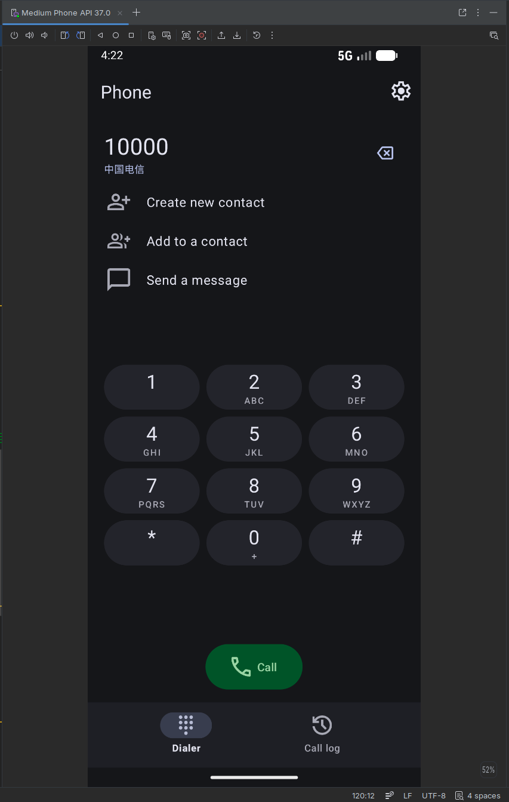
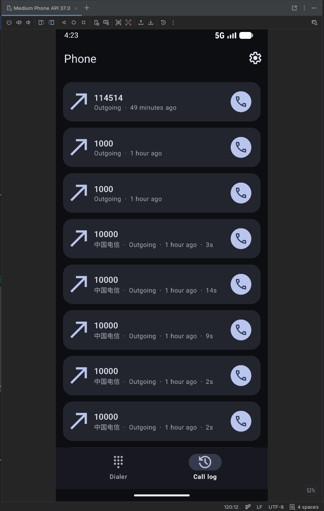
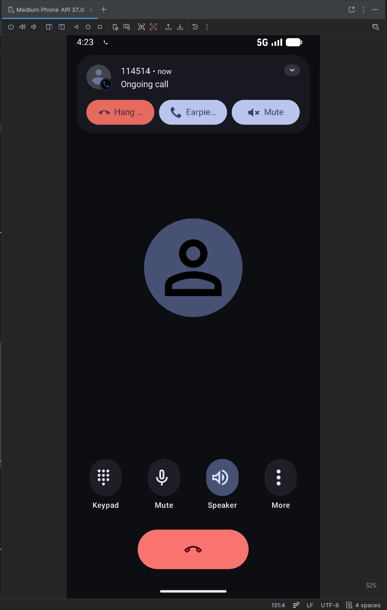
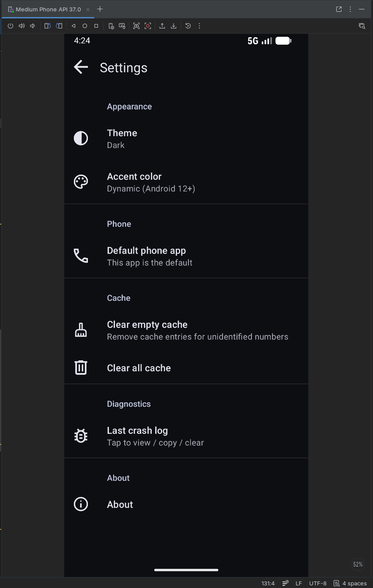

# Phone

Android 默认电话应用 / 来电识别。Material Design 3、Pixel 风格拨号器、系统级 CallStyle 通知、号码归属地查询。

## 截图

| 主页 | 通话记录 |
| :--: | :--: |
|  |  |

| 通话中 | 设置 |
| :--: | :--: |
|  |  |

## 下载

[Releases](https://github.com/LangYa466/PhoneApp/releases) 里找最新签名 APK。

## 技术

- minSdk 33 / targetSdk 35 / Java 17
- Telecom `InCallService` + `Notification.CallStyle`
- Material Components for Android 1.14 (MD3)
- libphonenumber 实时格式化
- OkHttp + Timber + Iconics (Material Symbols Outlined)

## 构建

```
gradle :app:assembleRelease
```

带签名的 release 见 [`CLAUDE.md`](CLAUDE.md) 的「签名」与「自动发布约定」。
